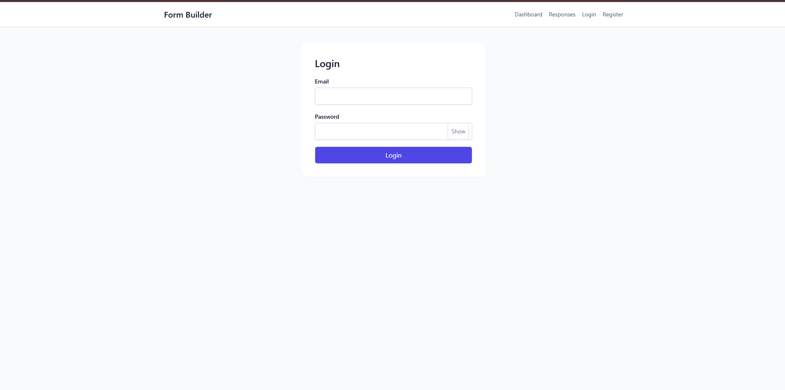
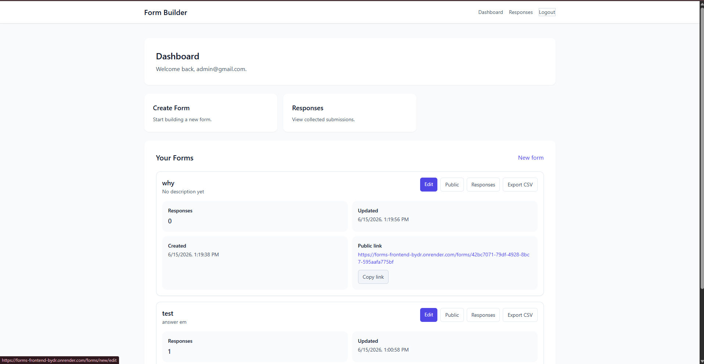
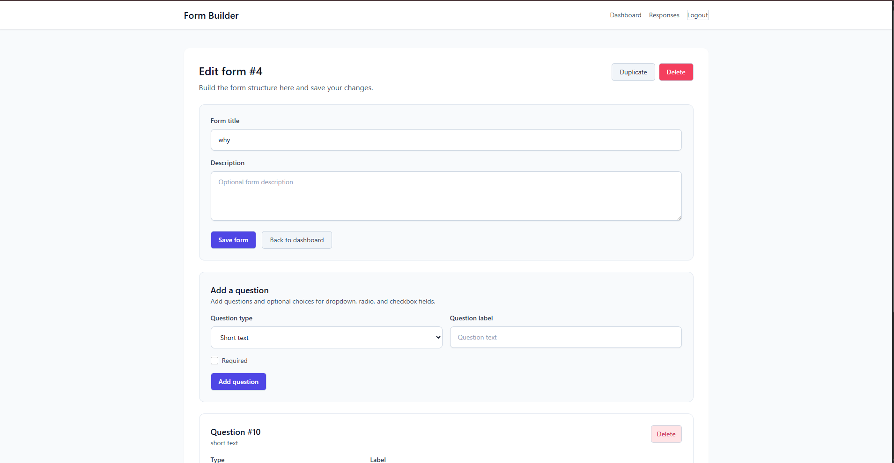
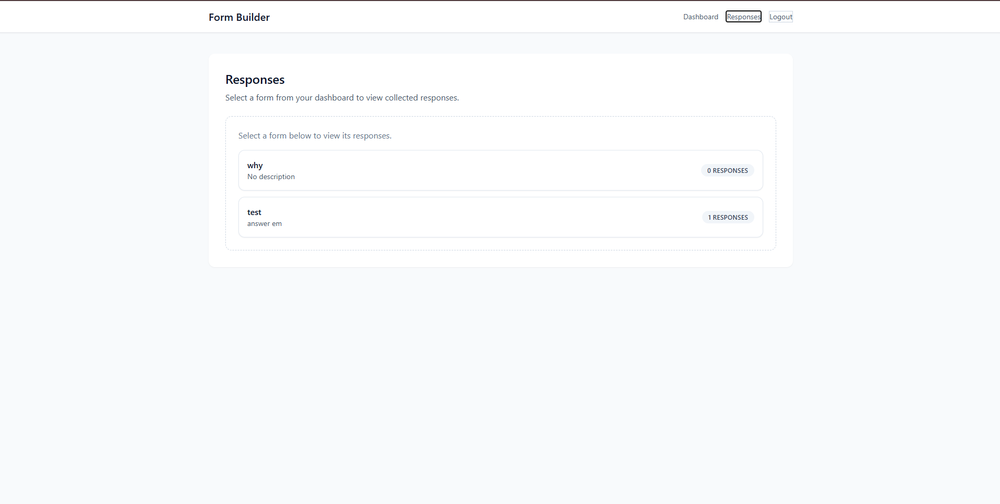

INTERN ID: CITS706
NAME: MOHAMMAD ARIF
NO. OF WEEKS: 1 WEEK
PROJECT NAME: FORM BUILDER
PROJECT SCOPE: DOCKERIZED WEB APPLICATION

# Form Builder - Docker Demonstration Project

> A containerized full-stack form builder application (React + Express + PostgreSQL) designed to demonstrate Docker concepts and containerization.

## What is This Project?

A full-stack form builder application with:
- **Frontend**: React 18 with Vite, served via Nginx
- **Backend**: Express.js API with JWT authentication
- **Database**: PostgreSQL 15

While the app itself is functional, this repository is primarily used as a **learning resource to demonstrate Docker concepts**.

---

## Why This Project Exists

This project was created to demonstrate:
1. **Multi-stage Docker builds** - How to build efficiently and ship minimal production images
2. **Docker Compose** - Orchestrating multi-container applications
3. **Container networking** - Services communicating over isolated networks
4. **Volume management** - Persistent data with PostgreSQL
5. **Environment configuration** - Flexible configuration via `.env` and Docker
6. **Health checks & retries** - Handling service dependencies gracefully

## Docker Demonstration Guide

### Key Docker Concepts Demonstrated

| Concept | File | What You'll Learn |
|---------|------|-------------------|
| Multi-stage builds | `frontend/Dockerfile` | Building with full toolchain, shipping minimal runtime |
| Layer caching | Both Dockerfiles | Optimizing build times with intelligent layer ordering |
| Multi-container orchestration | `docker-compose.yml` | Managing complex applications with multiple services |
| Network isolation | `docker-compose.yml` (`formnet`) | Container-to-container communication |
| Volume persistence | `docker-compose.yml` (`pgdata`) | Data survives container restarts |

### Quick Start

```bash
# Build and start all services
docker compose up --build

# Access the application
# Frontend: http://localhost:3000
# Backend API: http://localhost:4000/api
```

### Docker Commands You'll Encounter

| Command | Purpose |
|---------|---------|
| `docker build -t myapp .` | Build an image from a Dockerfile |
| `docker compose up --build` | Build images and start containers |
| `docker compose down` | Stop all containers |
| `docker compose down -v` | Stop and remove volumes (database reset) |
| `docker compose build backend` | Rebuild a specific service |
| `docker compose logs -f` | Follow logs from all services |
| `docker ps` | List running containers |

### Understanding the Architecture

```
┌─────────────────┐
│     Frontend    │
│  (nginx:80)     │
└────────┬────────┘
         │
         │ proxy_pass
         │
┌────────▼────────┐
│     Backend     │
│  (node:4000)    │
└────────┬────────┘
         │
         │ PostgreSQL
         │
┌────────▼────────┐
│    PostgreSQL   │
│  (postgres:5432)│
└─────────────────┘
```

### Dockerfile Breakdown

**Frontend (Multi-stage)**:
```dockerfile
# Stage 1: Build
FROM node:20-alpine AS build
# Install deps, build production bundle

# Stage 2: Production
FROM nginx:stable-alpine
# Copy only the built assets
# Serve with minimal nginx
```

**Backend**:
```dockerfile
FROM node:20-alpine
# Install production deps only
# Run the app directly
```

### Common Docker Tasks

**Reset the database**:
```bash
docker compose down -v
docker compose up --build
```

**View logs from a specific service**:
```bash
docker compose logs -f backend
docker compose logs -f frontend
```

**Rebuild without cache**:
```bash
docker compose build --no-cache backend
```

**Run a one-off command in a container**:
```bash
docker compose run --rm backend sh
docker compose run --rm frontend sh
```

---

## Project Structure

- `frontend/` - React (Vite) frontend app served by Nginx
- `backend/` - Node.js + Express API
- `database/` - PostgreSQL initialization SQL
- `docker-compose.yml` - Defines all services

---

## API Overview

Base URL: `/api`

**Auth**:
- `POST /api/auth/register` - Register user
- `POST /api/auth/login` - Login
- `GET /api/auth/me` - Current user (protected)

**Forms** (protected):
- `GET /api/forms` - List forms
- `POST /api/forms` - Create form
- `GET /api/forms/:id` - Get form
- `PUT /api/forms/:id` - Update form
- `DELETE /api/forms/:id` - Delete form

**Public** (anonymous):
- `GET /api/public/forms/:publicId` - Fetch public form
- `POST /api/public/forms/:publicId/responses` - Submit response

---

## Environment Variables

Key variables (see `.env.example`):

- `PORT` - Backend port (default: 4000)
- `DATABASE_URL` - PostgreSQL connection string
- `JWT_SECRET` - Authentication secret
- `VITE_API_URL` - API base URL for frontend build

---

## Development (Non-Docker)

```bash
# Backend
cd backend
npm install
npm run dev

# Frontend
cd frontend
npm install
npm run dev
```

The frontend API client uses `VITE_API_URL` when set, otherwise defaults to `http://localhost:4000/api` in dev.

---

## Database Schema

Main tables:
- `users` - User accounts
- `forms` - Form definitions
- `questions` - Form questions
- `options` - Question options
- `responses` - Form submissions
- `answers` - Individual answers

---

## Learning Resources

This project demonstrates Docker fundamentals. To learn more:

1. **Docker docs**: https://docs.docker.com/
2. **Docker Compose**: https://docs.docker.com/compose/
3. **Best practices**: https://docs.docker.com/develop/_best-practices/

---

## Screenshots

| Login | Dashboard |
|-------|-----------|
|  |  |

| Forms | Responses |
|-------|-----------|
|  |  |
